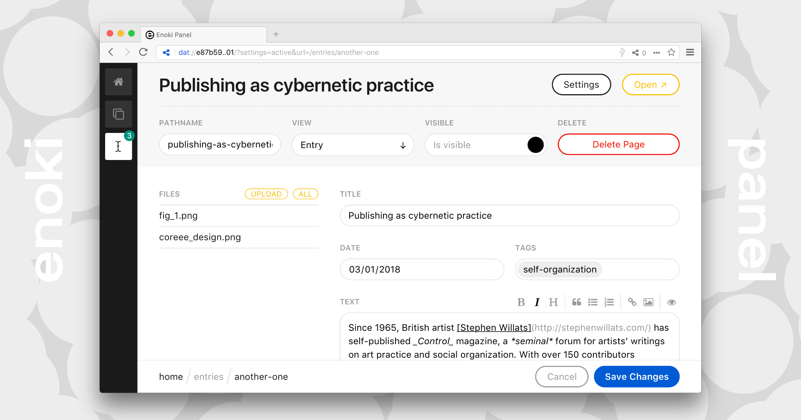

<h1 align="center"> Enoki Panel (beta)</h1>

The Enoki Panel is an ultralight set of tools for creating websites and applications. It’s early in development and runs exclusively in the experimental [Beaker Browser](https://beakerbrowser.com) as some of the primary concerns the project engages are those of data ownership, archival, and platform mutability.

Consider this a modestly functional sketch. A starting point with clear limitations, leaning on existing and familiar convention to form a foundation for spanning the gap between here and there.

## Features

- **nodb**: only static files and folders
- **extensible**: easily define custom fieldsets and create your own fields
- **simple**: built entirely on [choo](https://choo.io), the cutest front-end framework
- **offline**: create and edit your sites offline, sync when reconnecting

## Development

- Clone this repository
- Open Beaker Browser and create a new site
- Change the folder to the repository
- **`cd source`** open the source directory
- **`npm install`** install dependencies
- **`npm start`** watch for changes
- **`npm build`** bundle for production

You now have a fully standalone instance of the Enoki Panel free modify however you’d like. I’d suggest if you’d like to receive updates to create a git repository and branch for your changes. Add this repository as a source and merge in changes every once in a while.

## Guides

For help getting started, managing your sites, and customization, open the Enoki Panel and navigate to **Hub** → **Guides**.